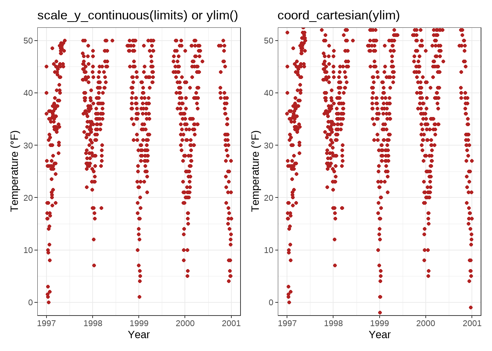

```{r setup, include=FALSE, eval=FALSE}
knitr::opts_chunk$set(echo = TRUE)
```


**Source**
https://cedricscherer.netlify.app/2019/08/05/a-ggplot2-tutorial-for-beautiful-plotting-in-r/

# Load data and assign Dataset

```{r load_data}
chic <- readr::read_csv("https://raw.githubusercontent.com/Z3tt/R-Tutorials/master/ggplot2/chicago-nmmaps.csv")

tibble::glimpse(chic)
```

```{r head}
head(chic,10)
```

# A Default ggplot
##library(ggplot2)

```{r tidyverse}
library(tidyverse)
```

We specify the data outside `aes()` and add the variables that ggplot maps the aesthetics to inside `aes()`

## 1st: We map the variable date to the x position and temp to the y position
```{r maptemp}
(g <- ggplot(chic, aes(x = date, y = temp)))
```

## 2nd: Now we need to provide geometry, so that ggplot knows how we want to plot that data!

### geom_point() to create a scatter plot:
```{r geompoint}
# geom_point() to create a scatter plot:
g + geom_point()
```

### `geom_line()` to create a line plot (not optimal though):

```{r geomline}
# geom_line() to create a line plot (not optimal though):
g + geom_line()
```

### combine both:

```{r geompointandline}
# combine both:
g + geom_line() + geom_point()
```

## 3rd: Change Properties of Geometries

Within the `geom_*` , you can manipulate visual aesthetics such as the color, shape, and size of your points

```{r geompoint_colour_shape_size}
g + geom_point(color = "firebrick", shape = "diamond", size = 2)
```
Each geom comes with its own properties (called arguments) and the same argument may result in a different change depending on the geom you are using.

```{r geomline_colour_shape_size}
g + geom_point(color = "firebrick", shape = "diamond", size = 2) +
    geom_line(color = "firebrick", linetype = "dotted", size = .3)
```


## 4th: Replace the default ggplot2 theme

And to illustrate some more of ggplot’s versatility, let’s get rid of the grayish default {ggplot2} look by setting a different built-in theme, e.g. `theme_bw()` —by calling `theme_set()` all following plots will have the same black’n’white theme. The red points look way better now!

```{r set_theme}
theme_set(theme_bw())

g + geom_point(color = "firebrick")
```

`theme()` is an essential command to manually modify all kinds of theme elements (texts, rectangles, and lines).

# Working with Axes

## Change Axis Titles

the `labs()` command provides a character string for each label we want to change (here x and y):

```{r axis}
ggplot(chic, aes(x = date, y = temp)) +
  geom_point(color = "firebrick") + 
  labs(x = "Year", y = "Temperature (ºF)")
```

** 💁 You can also add each axis title via `xlab()` and `ylab()`** Example:
```{r axis2}
ggplot(chic, aes(x = date, y = temp)) +
  geom_point(color = "firebrick") +
  xlab("Year") + 
  ylab("Temperature (ºF")
```

The code below also allows to add not only symbols but e.g. superscripts (with the use of `^`):

```{r axis_superscripts}
ggplot(chic, aes(x = date, y = temp)) +
  geom_point(color = "firebrick") +
  labs(x = "Year", y = expression(paste("Temperature (", degree ~ F, ")"^"(Hey, why should we use metric units?!)")))
```

## Increase Space between Axis and Axis Titles

We can change the properties of all or particular text elements (here axis titles) by overwriting the default `element_text()` within the `theme()` call:

```{r axis3}
ggplot(chic, aes(x = date, y = temp)) +
  geom_point(color = "firebrick") +
  labs(x = "Year", y = "Temperature (°F)") +
  theme(axis.title.x = element_text(vjust = 0, size = 15),
        axis.title.y = element_text(vjust = 2, size = 15))
```

the `vjust` command refers to the vertical alignment, which usually ranges between 0 and 1, **but you can also specify values outside that range**

- `vjust` (which is correct form the label’s perspective)

- but you can also change the distance by specifying the margin of both text elements:

```{r margindistance}
ggplot(chic, aes(x = date, y = temp)) +
  geom_point(color = "firebrick") +
  labs(x = "Year", y = "Temperature (°F)") +
  theme(axis.title.x = element_text(margin = margin(t = 10), size = 15),
        axis.title.y = element_text(margin = margin(r = 10), size = 15))
```

The labels **t** and **r** within the margin() object refer to **top** and **right**

- You can also specify the four margins as margin (t, r, b, l). Note that we now have to change the right margin to modify the space on the y axis, not the bottom margin.

💡 A good way to remember the order of the margin sides is “t-r-oub-l-e”.

## Change Aesthetics of Axis Titles
Within the e`lement_text()` we can for example overwrite the defaults for size, color, and face:

```{r element_text}
ggplot(chic, aes(x = date, y = temp)) + 
  geom_point(color = "firebrick") + 
  labs(x = "Year", y = "Temperature (ºF)") + 
  theme(axis.title = element_text(size = 15, color = "firebrick", face = "italic"))
```

The `face` argument can be used to make the font `bold` or `italic` or even `bold.italic`.

```{r face}
ggplot(chic, aes(x = date, y = temp)) +
  geom_point(color = "firebrick") +
  labs(x = "Year", y = "Temperature (°F)") +
  theme(axis.title.x = element_text(color = "sienna", size = 15),
        axis.title.y = element_text(color = "orangered", size = 15))
```

💁 You could also use a combination of `axis.title` and `axis.title.y`, since `axis.title.x` inherits the values from `axis.title`. Example:

```{r axis.title}
ggplot(chic, aes(x = date, y = temp)) + 
  geom_point(color = "firebrick") + 
  labs(x = "Year", y = "Temperature (ºF)") + 
  theme(axis.title = element_text(color = "sienna", size = 15), 
        axis.title.y = element_text(color = "orangered", size = 15))
```

One can modify some properties for both axis titles and other only for one or properties for each on its own:

```{r modify_axis_titles}
ggplot(chic, aes(x = date, y = temp)) +
  geom_point(color = "firebrick") + 
  labs(x = "Year", y = "Temperature (ºF)") + 
  theme(axis.title = element_text(color = "sienna", size = 15, face = "bold"), axis.title.y = element_text(face = "bold.italic"))

```

## Change Aesthetics of Axis Text

You can also change the appearance of the axis text (*here the numbers*) by using `axis.text`and/or the subordinated elements `axis.text.x` and `axis.text.y`:

```{r modify_axis_text}
ggplot(chic, aes(x = date, y = temp)) +
  geom_point(color = "firebrick") +
  labs(x = "Year", y = "Temperature (°F)") +
  theme(axis.text = element_text(color = "dodgerblue", size = 12),axis.text.x = element_text(face = "italic"))
```
## Rotate Axis Text
```{r rotate_axis_text}
ggplot(chic, aes(x = date, y = temp)) +
  geom_point(color = "firebrick") +
  labs(x = "Year", y = "Temperature (°F)") +
  theme(axis.text.x = element_text(angle = 50, vjust = 1, hjust = 1, size = 12))
```

## Remove Axis Text & Ticks
```{r remove_axis_text_ticks}
ggplot(chic, aes(x = date, y = temp)) +
  geom_point(color = "firebrick") +
  labs(x = "Year", y = "Temperature (°F)") +
  theme(axis.ticks.y = element_blank(),
        axis.text.y = element_blank())
```
`element_blank()` removes the element (and thus is not considered an official element)

💡 Use it if you want to get rid of a theme element

## Remove Axis Titles

We could again use `theme_blank()` but it is way simpler to just remove the label in the `labs()` (or `xlab()`) call:

```{r remove_axis_titles}
ggplot(chic, aes(x = date, y = temp)) +
  geom_point(color = "firebrick") +
  labs(x = NULL, y = "")
```
💡 Note that NULL removes the element (similarly to element_blank()) while empty quotes "" will keep the spacing for the axis title and simply print nothing.

## Limit Axis Range

You can ZOOM IN instead of subsetting your data:

```{r Zoom_limit}
ggplot(chic, aes(x = date, y = temp)) +
  geom_point(color = "firebrick") +
  labs(x = "Year", y = "Temperature (°F)") +
  ylim(c(0, 50))
```

You can also use `scale_y_continuous(limits = c(0, 50))` or `coord_cartesian(ylim = c(0, 50)`). The former removes all data points outside the range while the second adjusts the visible area and is similar to `ylim(c(0, 50))`. 
*You may wonder:* So in the end both result in the same. But not really, there is an important difference—compare the two following plots:

```{r imageStart, echo=FALSE, out.width="20%"}

```

You might have spotted that on the left there is some empty buffer around your y limits while on the right points are plotted right up to the border and even beyond. This perfectly illustrates the subsetting (left) versus the zooming (right). To show why this is important let’s have a look at a different chart type, a box plot:

```{r imageStart2, echo=FALSE, out.width="20%"}
knitr::include_graphics("images/axis-limit-comp-box-1.png")
```
*...* Because scale_x|y_continuous() subsets the data first, we get completely different (and wrong, at least if in the case this was not your aim) estimates for the box plots! I hope you don’t have to go back to your old scripts now and check if you maybe have manipulated your data while plotting and did report wrong summary stats in your report, paper or thesis…

## Force Plot to Start at Origin

You can also force R to plot the graph starting at the origin:

```{r plot_graph_from_origin}

library(tidyverse)

chic_high <- dplyr::filter(chic, temp > 25, o3 > 20)

ggplot(chic_high, aes(x = temp, y = o3)) +
  geom_point(color = "darkcyan") +
  labs(x = "Temperature higher than 25°F",
       y = "Ozone higher than 20 ppb") +
  expand_limits(x = 0, y = 0)
```
💁 Using `coord_cartesian(xlim = c(0, NA), ylim = c(0, NA))` will lead to the same result:

```{r coord_cartesian}
library(tidyverse)

chic_high <- dplyr::filter(chic, temp > 25, o3 > 20)

ggplot(chic_high, aes(x = temp, y = o3)) +
  geom_point(color = "darkcyan") +
  labs(x = "Temperature higher than 25°F",
       y = "Ozone higher than 20 ppb") +
  coord_cartesian(xlim = c(0, NA), ylim = c(0, NA))
```

But again, we can force it to literally start plotting from the origin
```{r from_origin2}
ggplot(chic_high, aes(x = temp, y = o3)) +
  geom_point(color = "darkcyan") +
  labs(x = "Temperature higher than 25°F",
       y = "Ozone higher than 20 ppb") +
  expand_limits(x = 0, y = 0) +
  scale_x_continuous(expand = c(0, 0)) +
  scale_y_continuous(expand = c(0, 0)) +
  coord_cartesian(clip = "off")
```
💡 The argument clip = "off" in any coordinate system, always starting with coord_*, allows to draw outside of the panel area.

## Axes with Same Scaling

Here, let’s plot temperature against temperature with some random noise.

The `coord_equal()` is a coordinate system with a specified ratio representing the number of units on the y-axis equivalent to one unit on the x-axis. The default, `ratio = 1`, ensures that one unit on the x-axis is the same length as one unit on the y-axis:

```{r coord_fixed}
ggplot(chic, aes(x = temp, y = temp + rnorm(nrow(chic), sd = 20))) +
  geom_point(color = "sienna") +
  labs(x = "Temperature (°F)", y = "Temperature (°F) + random noise") +
  xlim(c(0, 100)) + ylim(c(0, 150)) +
  coord_fixed()
```

Ratios higher than one make units on the y axis longer than units on the x-axis, and vice versa:

```{r higher_ratios}
ggplot(chic, aes(x = temp, y = temp + rnorm(nrow(chic), sd = 20))) + 
  geom_point(color = "sienna") + 
  labs(x = "Temperature (ºF)", y = "Temperature (ºF) + random noise") + 
  xlim(c(0,100)) + ylim(c(0, 150)) +
  coord_fixed(ratio = 1/5)
```

## Use a Function to Alter Labels

Sometimes it is handy to alter your labels a little, perhaps adding **units** or **percent signs** without adding them to your data. You can use a function in this case:

```{r edit_labels}
ggplot(chic, aes(x = date, y = temp)) + 
  geom_point(color = "firebrick") +
  labs(x = "Year", y = NULL)+ 
  scale_y_continuous(label = function(x) {return(paste(x, "Degrees Fahrenheit"))})
```


# Working with Titles

## Add a Title
We can add a title with the `ggtitle()` function:
```{r add_title}
ggplot(chic, aes(x = date, y = temp)) + 
  geom_point(color = "firebrick") + 
  labs(x = "Year", y = "Temperature (ºF)") +
  ggtitle("Temperatures in Chicago")
```
Alternatively, you can use labs(). Here you can add several arguments, e.g. additionally a subtitle, a caption and a tag (as well as axis titles as shown before):

```{r add_title_subtitle_caption_tag_with_labs}

ggplot(chic, aes(x = date, y = temp)) + 
  geom_point(color = "firebrick") + 
  labs(x = "Year", y = " Temperature (ºF)",
       title = "Temperatures in Chicago",
       subtitle = "Seasonal pattern of daily temperatures form 1997 to 2001",
       caption = "Data: NMMAPS",
       tag = "Fig.1")
```

## Make Title Bold & Add a Space at the Baseline

Again, since we want to modify the properties of a theme element, we use the `theme()` function and as for the text elements `axis.title` and `axis.text` modify the font face and the margin. All the following modifications of theme elements work not only for the title but for all other labels such as `plot.subtitle`, `plot.caption`, `plot.caption`, `legend.title`, `legend.text`, and `axis.title` and `axis.text`.

```{r bold_title_add_baseline_space}
ggplot(chic, aes(x = date, y = temp)) +
  geom_point(color = "firebrick") +
  labs(x = "Year", y = "Temperature (°F)",
       title = "Temperatures in Chicago") +
  theme(plot.title = element_text(face = "bold",
                                  margin = margin(10, 0, 10, 0),
                                  size = 14))
```
💡 A nice way to remember the order of the margin arguments is **“t-r-oub-l-e”** that resembles the first letter of the four sides.

## Adjust Position of Titles
The general alignment (left, center, right) is controlled by `hjust` (which stands for horizontal adjustment):

```{r adjust_titles_position}
ggplot(chic, aes(x = date, y = temp)) +
  geom_point(color = "firebrick") +  
  labs(x = "Year", y = NULL,
       title = "Temperatures in Chicago",
       caption = "Data: NMMAPS") +
  theme(plot.title = element_text(hjust = 1, size = 16, face = "bold.italic"))
```

You can also +adjust the vertical alignment, with `vjust.`

You can specify the alignment of the title, subtitle, and caption either based on the panel area (the default) or the plot margin via `plot.title.position` and `plot.caption.position`. The later is actually the better choice designwise in most cases and many people were very happy about that new feature since especially with very long y axis labels the alignment looks awful:


```{r plot.title}
(g <- ggplot(chic, aes(x = date, y = temp)) +
  geom_point(color = "firebrick") +  
  scale_y_continuous(label = function(x) {return(paste(x, "Degrees Fahrenheit"))}) +
  labs(x = "Year", y = NULL,
       title = "Temperatures in Chicago between 1997 and 2001 in Degrees Fahrenheit",
       caption = "Data: NMMAPS") +
  theme(plot.title = element_text(size = 14, face = "bold.italic"),
        plot.caption = element_text(hjust = 0)))
```
```{r theme}
g + theme(plot.title.position = "plot",
          plot.caption.position = "plot")
```
## Use a Non-Traditional Font in Your Title

You can also use different **fonts** not only the default one provided by ggplot (and which differs between operating systems). There are several packages that help you to use fonts which are installed on your machine (and you may be using in your office program). Here, I use the `showtext` package that makes it easy to use various types of fonts (*TrueType, OpenType, Type 1, web fonts*, etc.) in R plots. After we have loaded the package, you need to import the font that has to be installed on your device as well. I regularly use Google fonts that can be imported with the function `font_add_google()` but you can also add other fonts with `font_add()`. (Note that even in case of using Google fonts you must install the font—and restart Rstudio—to use the font.)

```{r add_fonts}
library(showtext)
font_add_google("Playfair Display",
                "Playfair") 

font_add_google("Playfair Display", "Playfair Display")
```

Now, we can use those font families using: ...... `theme()`:

```{r eval=FALSE} 
ggplot(chic, aes(x = date, y = temp)) +
  geom_point(color = "firebrick") +
  labs(x = "Year", y = "Temperature (°F)",
       title = "Temperatures in Chicago",
       subtitle = "Daily temperatures in °F from 1997 to 2001") +
  theme(plot.title = element_text(family = "Bangers", hjust = .5, size = 10),
        plot.subtitle = element_text(family = "Playfair", hjust = .5, size = 5))
```

```{r roboto_font}
font_add_google("Roboto Condensed", "Roboto Condensed")
theme_set(theme_bw(base_size = 12, base_family = "Roboto Condensed"))
```

## Change Spacing in Multi-Line Text

You can use the `lineheight` argument to change the spacing between lines. In this example, I have squished the lines together (lineheight < 1).

```{r change_spacing, eval=FALSE}
ggplot(chic, aes(x = date, y = temp)) +
  geom_point(color = "firebrick") +
  labs(x = "Year", y = "Temperature (°F)") +
  ggtitle("Temperatures in Chicago\nfrom 1997 to 2001") +
  theme(plot.title = element_text(lineheight = .8, size = 16))
```

# Working with Legends

We will color code the plot based on season.
Or to phrase it in a more ggplot’ish way: we map the variable `season` to the `aes`thetic `color`. 

One nice thing about `{ggplot2}` is that it adds a legend by default when mapping a variable to an aesthetic. You can see that by default the legend title is what we specified in the color argument:

```{r legend_title_default, eval=FALSE}
ggplot(chic,
       aes(x = date, y = temp, color = season)) +
  geom_point() +
  labs(x = "Year", y = "Temperature (°F)")
```

## Turn Off the Legend

Always one of the first question is: **“How can I get rid of the legend?”**.

It is quite easy and always works with `theme(legend.position = "none")`:

```{r remove_legend, eval=FALSE}
ggplot(chic,
       aes(x = date, y = temp, color = season)) +
  geom_point() +
  labs(x = "Year", y = "Temperature (°F)") +
  theme(legend.position = "none")
```

You can also use `guides(color = "none")` or `scale_color_discrete(guide = "none")` depending on the specific case. While the change of the theme element removes all legends at once, you can remove particular legends with the latter options while keeping some others:

```{r remove_specific_legends, eval=FALSE}
ggplot(chic,
       aes(x = date, y = temp,
           color = season, shape = season)) +
  geom_point() +
  labs(x = "Year", y = "Temperature (°F)") +
  guides(color = "none")
```

Here, for example, we keep the legend for the shapes while discarding the one for the colors.

## Remove Legend Titles

As we already learned, use `element_blank()` to draw _nothing_:
```{r element_blank, eval=FALSE}

ggplot(chic, aes(x = date, y = temp, color = season)) +
  geom_point() +
  labs(x = "Year", y = "Temperature (°F)") +
  theme(legend.title = element_blank())
```
💁 You can achieve the same by setting the legend name to NULL, either via `scale_color_discrete(name = NULL)` or `labs(color = NULL)`.

```{r legendtonull, eval=FALSE}
ggplot(chic, aes(x = date, y = temp, color = season)) +
  geom_point() +
  labs(x = "Year", y = "Temperature (°F)") +
  scale_color_discrete(name = NULL)
```

```{r legendtonull2, eval=FALSE}
ggplot(chic, aes(x = date, y = temp, color = season)) +
  geom_point() +
  labs(x = "Year", y = "Temperature (°F)") +
  labs(color = NULL)
```

## Change Legend Position

If you want to place the legend not on the right, you can use `legend.position` as argument in `theme`. Possible positions are **“top”**, **“right”** (which is the default), **“bottom”**, and **“left”**.

```{r change_legend.positiong_in_theme, eval=FALSE}
ggplot(chic, aes(x = date, y = temp, color = season)) +
  geom_point() +
  labs(x = "Year", y = "Temperature (°F)") +
  theme(legend.position = "top")
```

You can also place the legend inside the panel by specifying a vector with relative x and y coordinates ranging from 0 (left or bottom) to 1 (right or top):

```{r legend_inside_panel, eval=FALSE}
ggplot(chic, aes(x = date, y = temp, color = season)) +
  geom_point() +
  labs(x = "Year", y = "Temperature (°F)",
       color = NULL) +
  theme(legend.position = c(.15, .15),
        legend.background = element_rect(fill = "transparent"))
```

Above I also overwrite the default white legend background with a transparent fill to make sure the legend does not hide any data points.

## Change Legend Direction

As you have seen, the legend direction is by default vertical but horizontal when you choose either the **“top”** or **“bottom”** position. But you can also switch the direction as you like:

```{r legend_direction, eval=FALSE}
ggplot(chic, aes(x = date, y = temp, color = season)) +
  geom_point() +
  labs(x = "Year", y = "Temperature (°F)") +
  theme(legend.position = c(.5, .97),
        legend.background = element_rect(fill = "transparent")) +
  guides(color = guide_legend(direction = "horizontal"))
```

## Change Style of the Legend Title
You can change the appearance of the legend title by adjusting the theme element `legend.title`:

```{r theme_legend_title, eval=FALSE}
ggplot(chic, aes(x = date, y = temp, color = season)) +
  geom_point() +
  labs(x = "Year", y = "Temperature (°F)") +
  theme(legend.title = element_text(family = "Playfair",
                                    color = "chocolate",
                                    size = 14, face = "bold"))
```

## Change Legend Title
The easiest way to change the title of the legend is the `labs()` layer:

```{r change_legen_in_labs, eval=FALSE}
ggplot(chic, aes(x = date, y = temp, color = season)) +
  geom_point() +
  labs(x = "Year", y = "Temperature (°F)",
       color = "Seasons\nindicated\nby colors:") +
  theme(legend.title = element_text(family = "Playfair",
                                    color = "chocolate",
                                    size = 14, face = "bold"))
```

The legend details can be changed via `scale_color_discrete(name = "title")` or `guides(color = guide_legend("title"))`:

```{r change_legend_details, eval=FALSE}
ggplot(chic, aes(x = date, y = temp, color = season))) +
  geom_point() +
  labs(x = "Year", y = "Temperature (°F)") +
  theme(legend.title = element_text(family = "Playfair",
                                    color = "chocolate",
                                    size = 14, face = "bold")) +
  scale_color_discrete(name = "Seasons\nindicated\nby colors:")
```

## Change Order of Legend Keys
We can achieve this by changing the levels of `season`:

```{r change_season_levels, eval=FALSE}
chic$season <- 
  factor(chic$season, 
         levels = c("Winter", "Spring", "Summer", "Autumn"))

ggplot(chic, aes(x = date, y = temp, color = season)) +
  geom_point() +
  labs(x = "Year", y = "Temperature (°F)")
```

## Change Legend Labels
We are going to replace the seasons by the months which they are covering by providing a vector of names in the `scale_color_discrete()` call:

```{r replace_seasons_by_months, eval=FALSE}
ggplot(chic, aes(x = date, y = temp, color = season)) +
  geom_point() +
  labs(x = "Year", y = "Temperature (°F)") +
  scale_color_discrete("Seasons:", labels = c("Mar—May", "Jun—Aug",
                                              "Sep—Nov", "Dec—Feb")) +
  theme(legend.title = element_text(family = "Playfair",
                                    color = "chocolate",
                                    size = 14, face = 2))
```

## Change Background Boxes in the Legend
To change the background color (fill) of the legend keys, we adjust the setting for the theme element `legend.key`:

```{r change_legend_key, eval=FALSE}
ggplot(chic, aes(x = date, y = temp, color = season)) +
  geom_point() +
  labs(x = "Year", y = "Temperature (°F)") +
  theme(legend.key = element_rect(fill = "darkgoldenrod1"),
        legend.title = element_text(family = "Playfair",
                                    color = "chocolate",
                                    size = 14, face = 2)) +
  scale_color_discrete("Seasons:")
```

If you want to get rid of them entirely use `fill = NA` or `fill = "transparent"`.

## Change Size of Legend Symbols
Points in the legend can get a little lost with the default size, especially without the boxes. To override the default one uses again the guides layer like this:

```{r no_background_color, eval=FALSE}
ggplot(chic, aes(x = date, y = temp, color = season)) +
  geom_point() +
  labs(x = "Year", y = "Temperature (°F)") +
  theme(legend.key = element_rect(fill = NA),
        legend.title = element_text(color = "chocolate",
                                    size = 14, face = 2)) +
  scale_color_discrete("Seasons:") +
  guides(color = guide_legend(override.aes = list(size = 6)))
```

## Leave a Layer Off the Legend
Let’s say you have two different geoms mapped to the same variable. For example, color as an aesthetic for both a point layer and a rug layer of the same data. By default, both the points and the “line” end up in the legend like this:

```{r layer_off_legend, eval=FALSE}
ggplot(chic, aes(x = date, y = temp, color = season)) +
  geom_point() +
  labs(x = "Year", y = "Temperature (°F)") +
  geom_rug()
```

You can use `show.legend = FALSE` to turn off a layer in the legend:

```{r turn_off_layer, eval=FALSE}
ggplot(chic, aes(x = date, y = temp, color = season)) +
  geom_point() +
  labs(x = "Year", y = "Temperature (°F)") +
  geom_rug(show.legend = FALSE)

```

## Manually Adding Legend Items

`{ggplot2}` will not add a legend automatically unless you map aesthetics (color, size etc.) to a variable. There are times, though, that I want to have a legend so that it is clear what you are plotting.

Here is the default:

```{r default_for_legend, eval=FALSE}
ggplot(chic, aes(x = date, y = o3)) +
  geom_line(color = "gray") +
  geom_point(color = "darkorange2") +
  labs(x = "Year", y = "Ozone")
```

We can force a legend by mapping a guide to a _variable._ We are mapping the lines and the points using `aes()` and we are mapping **not** to a variable in our dataset but to a single string (so that we get just one color for each).
```{r force_legend_aes, eval=FALSE}
ggplot(chic, aes(x = date, y = o3)) + 
  geom_line(aes(color = "line")) + 
  geom_point(aes(color = "points")) +
  labs(x = "Year", y = "Ozone") +
  scale_color_discrete("Type:")
```

Not yet what we want!

We want gray and red! **To change the color**, we use `scale_color_manual()`. Additionally, we override the legend aesthetics using the `guide()` function.

Voila! Now, we have a plot with gray lines and red pints as well as a single gray line and a single red point as legend symbols:

```{r grey_and_red, eval=FALSE}
ggplot(chic, aes( x= date, y = o3)) +
  geom_line(aes(color = "line")) +
  geom_point(aes(color = "points")) +
  labs(x = "Year", y = "Ozone") +
  scale_color_manual(name = NULL,
                     guide = "legend",
                     values = c("points" = "darkorange2", 
                                "line" = "gray")) + 
  guides(color = guide_legend(override.aes = list(linetype = c(1, 0),
                                                  shape = c(NA, 16))))
```

## Use Other Legend Styles

The default legend for categorical variables such as `season` is a `guide_legend()` as you have seen in several previous examples. If you map a continuous variable to an aesthetic, `{ggplot2}` will by default not use `guide_legend()` but `guide_colorbar()` (or `guide_colourbar()`):

```{r default_legend, eval=FALSE}
ggplot(chic,
       aes(x = date, y = temp, color = temp)) +
  geom_point() +
  labs(x = "Year", y = "Temperature (°F)", color = "Temperature (°F)")
```

However, by using `guide_legend()` you can force the legend to show discrete colors for a given number of breaks as in case of a categorical variable:


```{r force_legend_discrete_colors}
# Error in grid.Call(C_textBounds, as.graphicsAnnot(x$label), x$x, x$y, : polygon edge not found

ggplot(chic,
       aes(x = date, y = temp, color = temp)) +
  geom_point() +
  labs(x = "Year", y = "Temperature (°F)", color = "Temperature (°F)") +
  guides(color = guide_legend())
``` 

You can also use binned scales:

```{r binned_scales}
ggplot(chic,
       aes(x = date, y = temp, color = temp)) +
  geom_point() +
  labs(x = "Year", y = "Temperature (°F)", color = "Temperature (°F)") +
  guides(color = guide_bins())
```

# Working with Backgrounds & Grid Lines

There are ways to change the entire look of your plot with one function (see “Working with Themes” section below) but if you want to **simply change the colors of some elements, you can also do that**.

## Change Grid Lines

There are two types of grid lines: major grid lines indicating the ticks and minor grid lines between the major ones. You can change all of these by overwriting the defaults for `panel.grid` or for each set of gridlines separately `panel.grid.major` and `panel.grid.minor`.

```{r overwrite_defaults_panelgrid}
ggplot(chic, aes(x = date, y = temp)) +
  geom_point(color = "firebrick") +
  labs(x = "Year", y = "Temperature (°F)") +
  theme(panel.background = element_rect(fill = "gray90"),
        panel.grid.major = element_line(color = "gray10", size = .5),
        panel.grid.minor = element_line(color = "gray70", size = .25))
```

You can even specify settings for all four different levels:

```{r specify_settings_all_levels}
ggplot(chic, aes(x = date, y = temp)) +
  geom_point(color = "firebrick") +
  labs(x = "Year", y = "Temperature (°F)") +
  theme(panel.background = element_rect(fill = "gray90"),
        panel.grid.major = element_line(size = .5, linetype = "dashed"),
        panel.grid.minor = element_line(size = .25, linetype = "dotted"),
        panel.grid.major.x = element_line(color = "red1"),
        panel.grid.major.y = element_line(color = "blue1"),
        panel.grid.minor.x = element_line(color = "red4"),
        panel.grid.minor.y = element_line(color = "blue4"))
```

And, of course, you can remove some or all grid lines if you like:

```{r remove_all_grid}
ggplot(chic, aes(x = date, y = temp)) +
  geom_point(color = "firebrick") +
  labs(x = "Year", y = "Temperature (°F)") +
  theme(panel.grid.minor = element_blank())
```


```{r remove_more_grid}
ggplot(chic, aes(x = date, y = temp)) +
  geom_point(color = "firebrick") +
  labs(x = "Year", y = "Temperature (°F)") +
  theme(panel.grid = element_blank())
```

Furthermore, you can also **define the breaks between both, major and minor grid lines**:

```{r define_breaks_bewteen_grid_lines}
ggplot(chic, aes(x = date, y = temp)) +
  geom_point(color = "firebrick") +
  labs(x = "Year", y = "Temperature (°F)") +
  scale_y_continuous(breaks = seq(0, 100, 10),
                     minor_breaks = seq(0, 100, 2.5))
```

## Change the Panel Background Color

To change the background color (fill) of the panel area (i.e. the area where the data is plotted), one needs to adjust the theme element `panel.background`:

```{r change_background_color_fill}
ggplot(chic, aes(x = date, y = temp)) +
  geom_point(color = "#1D8565", size = 2) +
  labs(x = "Year", y = "Temperature (°F)") +
  theme(panel.background = element_rect(fill = "#64D2AA",
                                        color = "#64D2AA", size = 2))

```

Note that the true color—the outline of the panel background—did not change even though we specified it. This is because there is **a layer on top** of the `panel.background`, namely `panel.border`. However,  make sure to use a transparent fill here, otherwise **your data is hidden behind this layer**. In the following example, I illustrate that by using a semitransparent hex color for the `fill` argument in `element_rect`:

```{r semitransparent_hex_color_for_fill}
ggplot(chic, aes(x = date, y = temp)) +
  geom_point(color = "#1D8565", size = 2) +
  labs(x = "Year", y = "Temperature (°F)") +
  theme(panel.border = element_rect(fill = "#64D2AA99",
                                    color = "#64D2AA", size = 2))
```

## Change the Plot Background Color
Similarly, to change the background color (fill) of the plot area, one needs to modify the theme element `plot.background`:

```{r plot_background}
ggplot(chic, aes(x = date, y = temp)) +
  geom_point(color = "firebrick") +
  labs(x = "Year", y = "Temperature (°F)") +
  theme(plot.background = element_rect(fill = "gray60",
                                       color = "gray30", size = 2))
```

You can achieve a unique background color by either setting the same colors in both `panel.background` and p`lot.background` or by setting the background filling of the panel to `"transparent"` or `NA`:

```{r background_na}
ggplot(chic, aes(x = date, y = temp)) +
  geom_point(color = "firebrick") +
  labs(x = "Year", y = "Temperature (°F)") +
  theme(panel.background = element_rect(fill = NA),
        plot.background = element_rect(fill = "gray60",
                                       color = "gray30", size = 2))
```
# Working with Margins
Sometimes it is useful to add a little space to the plot margin. Similar to the previous examples we can use an argument to the `theme()` function. In this case the argument is `plot.margin`. As In the previous example we already illustrated the default margin by changing the background color using `plot.background`.

+ Now let us add extra space to both the left and right. The argument, `plot.margin`, can handle a variety of different units (cm, inches, etc.) but it requires the use of the function unit from the package `grid` to specify the units. Here I am using a 5 cm margin on the right and left.

```{r add_space_margins}
ggplot(chic, aes(x = date, y = temp)) +
  geom_point(color = "firebrick") +
  labs(x = "Year", y = "Temperature (°F)") +
  theme(plot.background = element_rect(fill = "gray60"),
        plot.margin = unit(c(1, 3, 1, 8), "cm"))
```
The order of the margin sides is top, right, bottom, left—a nice way to remember this order is **trouble** that sorts the first letter of the four sides.

# Working with Multi-Panel Plots

The `{ggplot2}` package has **two** nice functions for creating multi-panel plots, called `facets`. They are related but a little different: `facet_wrap` **creates essentially a ribbon of plots based on a single variable** while `facet_grid` **spans a grid of two variables.**

## Create a Multi-Panel Plots Based on One Variable

`facet_wrap` creates a facet of a single variable, written with a tilde in front: `facet_wrap(~ variable)`. The appearance of these subplots is controlled by the arguments `ncol` and `nrow`:

```{r facet_ncol_nrow}
g <- ggplot(chic, aes(x = date, y = temp)) +
       geom_point(color = "chartreuse4", alpha = .3) +
       labs(x = "Year", y = "Temperature (°F)") +
       theme(axis.text.x = element_text(angle = 45, vjust = 1, hjust = 1))

g + facet_wrap(~ year, nrow = 1)
```

Accordingly, you can arrange the plots as you like as a matrix…


```{r arrange_plots_as_matrix}
g + facet_wrap(~ year, nrow = 2)
```

… or even as a asymmetric grid of plots:

```{r arrange_plots_as_asymetric_grid_of_plots}
g + facet_wrap(~ year, ncol = 3) + theme(axis.title.x = element_text(hjust = .15))
```

## Allow Scales to Roam Free
The default for multi-panel plots in `{ggplot2}` is to use equivalent scales in each panel. But sometimes you want to allow a panels own data to determine the scale. This is often not a good idea since it may give your user the wrong impression about the data. But sometimes it is indeed useful and to do this you can set `scales = "free"`:

```{r free_scales}
g + facet_wrap(~ year, nrow = 2, scales = "free")
```
**Note that both, x and y axes differ in their range!**

## Create a Grid of Plots Based on Two Variables
In case of two variables, `facet_grid` does the job. Here, the order of the variables determines the number of rows and columns:

```{r facet_grid}
ggplot(chic, aes(x = date, y = temp)) +
  geom_point(color = "orangered", alpha = .3) +
  theme(axis.text.x = element_text(angle = 45, vjust = 1, hjust = 1)) +
  labs(x = "Year", y = "Temperature (°F)") +
  facet_grid(year ~ season)
```

To change from row to column arrangement you can change `facet_grid(year ~ season)` to `facet_grid(season ~ year)`.

The function `facet_wrap` can also take two variables and you are still able to control the grid design:

```{r facet_wrap_two_variables}
g + facet_wrap(year ~ season, nrow = 4, scales = "free_x")
```

## Modify Style of Strip Texts
By using `theme`, you can modify the appearance of the strip text(i.e. the title for each facet) and the strip text boxes:

```{r modify_strip_text_with_theme}
g + facet_wrap(~ year, nrow = 1, scales = "free_x") +
  theme(strip.text = element_text(face = "bold", color = "chartreuse4",
                                  hjust = 0, size = 20),
        strip.background = element_rect(fill = "chartreuse3", linetype = "dotted"))
```

The following two functions allow to highlight specific labels in combination with `element_textbox()` that is provided by `{ggtext}`.

```{r highlight_specific_labels}
library(ggtext)
library(rlang)

element_textbox_highlight <- function(..., hi.labels = NULL, hi.fill = NULL,
                                      hi.col = NULL, hi.box.col = NULL, hi.family = NULL) {
  structure(
    c(element_textbox(...),
      list(hi.labels = hi.labels, hi.fill = hi.fill, hi.col = hi.col, hi.box.col = hi.box.col, hi.family = hi.family)
    ),
    class = c("element_textbox_highlight", "element_textbox", "element_text", "element")
  )
}

element_grob.element_textbox_highlight <- function(element, label = "", ...) {
  if (label %in% element$hi.labels) {
    element$fill <- element$hi.fill %||% element$fill
    element$colour <- element$hi.col %||% element$colour
    element$box.colour <- element$hi.box.col %||% element$box.colour
    element$family <- element$hi.family %||% element$family
  }
  NextMethod()
}
```

Now you can use it and specify for example all striptexts showing year:

```{r striptexts_showing_year}
g + facet_wrap(year ~ season, nrow = 4, scales = "free_x") +
  theme(
    strip.background = element_blank(),
    strip.text = element_textbox_highlight(
      family = "Playfair", size = 12, face = "bold",
      fill = "white", box.color = "chartreuse4", color = "chartreuse4",
      halign = .5, linetype = 1, r = unit(5, "pt"), width = unit(1, "npc"),
      padding = margin(5, 0, 3, 0), margin = margin(0, 1, 3, 1),
      hi.labels = c("1997", "1998", "1999", "2000"),
      hi.fill = "chartreuse4", hi.box.col = "black", hi.col = "white"
    )
  )
```
```{r change_striptext}
ggplot(chic, aes(x = date, y = temp)) +
  geom_point(aes(color = season == "Summer"), alpha = .3) +
  labs(x = "Year", y = "Temperature (°F)") +
  facet_wrap(~ season, nrow = 1) +
  scale_color_manual(values = c("gray40", "firebrick"), guide = "none") +
  theme(
    axis.text.x = element_text(angle = 45, vjust = 1, hjust = 1),
    strip.background = element_blank(),
    strip.text = element_textbox_highlight(
      size = 12, face = "bold",
      fill = "white", box.color = "white", color = "gray40",
      halign = .5, linetype = 1, r = unit(0, "pt"), width = unit(1, "npc"),
      padding = margin(2, 0, 1, 0), margin = margin(0, 1, 3, 1),
      hi.labels = "Summer", hi.family = "Bangers",
      hi.fill = "firebrick", hi.box.col = "firebrick", hi.col = "white"
    )
  )
```

## Create a Multi-Panel Plot Based on (Different) Plots

There are several ways how plots can be combined. The easiest approach in my opinion is the `{patchwork}` package by Thomas Lin Pedersen:

```{r combine_plots_with_patchwork}
p1 <- ggplot(chic, aes(x = date, y = temp,
                       color = season)) +
        geom_point() +
        geom_rug() +
        labs(x = "Year", y = "Temperature (°F)")

p2 <- ggplot(chic, aes(x = date, y = o3)) +
        geom_line(color = "gray") +
        geom_point(color = "darkorange2") +
        labs(x = "Year", y = "Ozone")

library(patchwork)
p1 + p2
```

We can change the order by “dividing” both plots (and note the alignment even though one has a legend and one doesn’t!):

```{r change_order_divide}
p1 / p2
```

And also nested plots are possible!

```{r nest_plots}
(g + p2) / p1
```

(Note the alignment of the plots even though only one row contains a legend.)

Alternatively, the `{cowplot}` package provides the functionality to combine multiple plots (and lots of other good utilities):

```{r combine_multiple_plots_cowplot}
library(cowplot)
plot_grid(plot_grid(g, p1), p2, ncol = 1)
```

… and so does the `{gridExtra}` package as well:

```{r gridextra}
library(gridExtra)
grid.arrange(g, p1, p2,
             layout_matrix = rbind(c(1, 2), c(3, 3)))
```

The same idea of defining a layout can be used with `{patchwork}` as well which allows to create complex compositions:

```{r patchwork_create_complex_compositions}
layout <- "
AABBBB#
AACCDDE
##CCDD#
##CC###
"

p2 + p1 + p1 + g + p2 +
  plot_layout(design = layout)
```

# Working with Colors

For simple applications working with colors is straightforward in `{ggplot2}`. For a more advanced treatment of the topic you should probably get your hands on **Hadley’s book** which has nice coverage. Other good sources are the **R Cookbook** and the **`color section in the R Graph Gallery by Yan Holtz**.

There are two main differences when it comes to colors in `{ggplot2}`. Both arguments, color and fill, can be

1. specified as single color or
2. assigned to variables.

As you have already seen in the beginning of this tutorial, variables that are inside the `aes`thetics are encoded by variables and those that are outside are properties that are unrelated to the variables. This complete nonsense plot showing the number of records per year and season illustrates that fact:

```{r nonsense_example_color}
ggplot(chic, aes(year)) +
  geom_bar(aes(fill = season), color = "grey", size = 2) +
  labs(x = "Year", y = "Observations", fill = "Season:")
```

## Specify Single Colors
Static, single colors are simple to use. We can specify a single color for a geom:

```{r specify_single_color_for_a_geom}
ggplot(chic, aes(x = date, y = temp)) +
  geom_point(color = "steelblue", size = 2) +
  labs(x = "Year", y = "Temperature (°F)")
```
… and in case it provides both, a color (outline color) and a fill (filling color):

```{r both_outline_and_fill_color}
ggplot(chic, aes(x = date, y = temp)) +
  geom_point(shape = 21, size = 2, stroke = 1,
             color = "#3cc08f", fill = "#c08f3c") +
  labs(x = "Year", y = "Temperature (°F)")
```

Tian Zheng at Columbia has created a useful **PDF of R colors**. Of course, you can also specify hex color codes (simply as strings as in the example above) as well as RGB or RGBA values (via the `rgb()` function: `rgb(red, green, blue, alpha)`).

## Assign Colors to Variables
In `{ggplot2}`, colors that are assigned to variables are modified via the `scale_color_*` and the `scale_fill_*` functions. In order to use color with your data, most importantly you need to know if you are dealing with a categorical or continuous variable. The color palette should be chosen depending on type of the variable, with sequential or diverging color palettes being used for continuous variables and qualitative color palettes for categorical variables:

```{r imageStart3, echo=FALSE, out.width="20%"}
knitr::include_graphics("images/map-principles-color-schemes.png")
```
Image source: “Hands-On Data Visualization” by Jack Dougherty & Ilya Ilyankou

## Qualitative Variables

Qualitative or categorical variables represent types of data which can be divided into groups (categories). The variable can be further specified as nominal, ordinal, and binary (dichotomous). Examples of qualitative/categorical variables are:

```{r imageStart4, echo=FALSE, out.width="20%"}
knitr::include_graphics("images/nominal_ordinal_binary.png")
```

Artwork by Allison Horst

The default categorical color palette looks like this:

```{r default_categorical_color_palette}
(ga <- ggplot(chic, aes(x = date, y = temp, color = season)) +
  geom_point() +
  labs(x = "Year", y = "Temperature (°F)", color = NULL))
```
## Manually Select Qualitative Colors

You can pick your own set of colors and assign them to a categorical variables via the function `scale_*_manual()` (the `*` can be either `color`, `colour`, or `fill`). The number of specified colors has to match the number of categories:

```{r set_colors}
ga + scale_color_manual(values = c("dodgerblue4",
                                   "darkolivegreen4",
                                   "darkorchid3",
                                   "goldenrod1"))
```

## Use Built-In Qualitative Color Palettes
The **ColorBrewer palettes** is a popular online tool for selecting color schemes for maps. The different sets of colors have been designed to produce attractive color schemes of similar appearance ranging from **three to twelve** . Those palettes are available as built-in functions in the `{ggplot2}` package and can be applied by calling `scale_*_brewer()`:

```{r built_in_color_palette}
ga + scale_color_brewer(palette = "Set1")
```

💡 You can explore all schemes available via `RColorBrewer::display.brewer.all()`.

## Use Qualitative Color Palettes from Extension Packages

There are many extension packages that provide additional color palettes. Their use differs depending on the way the package is designed. **For an extensive overview of color palettes available in R, check the collection provided by Emil Hvitfeldt**. One can also use his `{paletteer}` package, a comprehensive collection of color palettes in R that uses a consistent syntax.

Examples:

The `{ggthemes}` package for example lets R users access the **Tableau** colors. Tableau is a famous visualiztion software with a well-known color palette.

```{r tableau_palette}
library(ggthemes)
ga + scale_color_tableau()
```

The `{ggsci}` package provides scientific journal and sci-fi themed color palettes. Want to have a plot with colors that look like being published in Science or Nature? Here you go!

```{r ggsci_package_scientific}
library(ggsci)
g1 <- ga + scale_color_aaas()
g2 <- ga + scale_color_npg()

library(patchwork)
(g1 + g2) * theme(legend.position = "top")
```

## Quantitative Variables

Quantitative variables represent a measurable quantity and are thus numerical. Quantitative data can be further classified as being either continuous (floating numbers possible) or discrete (integers only):


```{r imageStart5, echo=FALSE, out.width="20%"}
knitr::include_graphics("images/continuous_discrete.png")
```
Artwork by Allison Horst

In our example we will change the variable we want to color to ozone, a continuous variable that is strongly related to temperature (higher temperature = higher ozone). The function `scale_*_gradient()` is a sequential gradient while `scale_*_gradient2() `is diverging.

Here is the default `{ggplot2}` sequential color scheme for continuous variables:

```{r default_ggplot2_sequential_color_scheme}
gb <- ggplot(chic, aes(x = date, y = temp, color = temp)) +
  geom_point() +
  labs(x = "Year", y = "Temperature (°F)", color = "Temperature (°F):")

gb + scale_color_continuous()
```

This code produces the same plot:

```{r same_plot}
gb + scale_color_gradient()
```

And here is the diverging default color scheme:

```{r diverging_color_scheme_gradient}
mid <- mean(chic$temp)  ## midpoint

gb + scale_color_gradient2(midpoint = mid)

```
## Manually Set a Sequential Color Scheme
You can manually set gradually changing color palettes for continuous variables via `scale_*_gradient()`:

```{r use_scale_gradient}
gb + scale_color_gradient(low = "darkkhaki",
                          high = "darkgreen")
```

Temperature data is normally distributed so how about a diverging color scheme (rather than sequential)… For diverging color you can use the `scale_*_gradient2()` function:

```{r gradient_for_temperature}
gb + scale_color_gradient2(midpoint = mid, low = "#dd8a0b",
                           mid = "grey92", high = "#32a676")
```

## The Beautiful Viridis Color Palette
The **viridis** color palettes do not only make your plots look pretty and good to perceive but also easier to read by those with **colorblindness** and print well in gray scale. You can test how your plots might appear under various form of colorblindness using `dichromate` package.

And they also come now shipped with `{ggplot2}`! The following multi-panel plot illustrates three out of the four viridis palettes:
```{r viridis_palettes}
p1 <- gb + scale_color_viridis_c() + ggtitle("'viridis' (default)")
p2 <- gb + scale_color_viridis_c(option = "inferno") + ggtitle("'inferno'")
p3 <- gb + scale_color_viridis_c(option = "plasma") + ggtitle("'plasma'")
p4 <- gb + scale_color_viridis_c(option = "cividis") + ggtitle("'cividis'")

library(patchwork)
(p1 + p2 + p3 + p4) * theme(legend.position = "bottom")
```
It is also possible to use the viridis color palettes for discrete variables:

```{r viridis_palettes_for_discretevars}
ga + scale_color_viridis_d(guide = "none")
```

## Use Quantitative Color Palettes from Extension Packages

The many extension packages provide not only additional categorical color palettes but also sequential, diverging and even cyclical palettes. Again, I point you to the great collection provided by Emil Hvitfeldt for an overview.

Examples:

+ The `{rcartocolors}` packages ports the beautiful **CARTOcolors** to `{ggplot2}` and contains several of my most-used palettes:

```{r cartocolor}
library(rcartocolor)
g1 <- gb + scale_color_carto_c(palette = "BurgYl")
g2 <- gb + scale_color_carto_c(palette = "Earth")

(g1 + g2) * theme(legend.position = "bottom")
```

+ The `{scico}` package provides access to the color palettes developed by _Fabio Crameri_. These color palettes are not only beautiful and often unusual but also a good choice since they have been developed to be perceptually uniform and ordered. In addition, they work for people with color vision deficiency and in grayscale:

```{r scico}
library(scico)
g1 <- gb + scale_color_scico(palette = "berlin")
g2 <- gb + scale_color_scico(palette = "hawaii", direction = -1)

(g1 + g2) * theme(legend.position = "bottom")
```

## Modify Color Palettes Afterwards

Since the latest release of `ggplot2 3.0.0`, one can modify layer aesthetics after they have been mapped to the data. Or as the `{ggplot2}` phrases it: “Use `after_scale()` to flag evaluation of mapping for after data has been scaled.”

So why not use the modified colors in the first place? Since `{ggplot2}` can **only handle one `color` and one `fill` scale**, this is an interesting functionality. 
Look closer at the following example where we use `invert_color()` from the `{ggdark}` package:

```{r invert_color_with_ggdark}
library(ggdark)

ggplot(chic, aes(date, temp, color = temp)) +
  geom_point(size = 5) +
  geom_point(aes(color = temp,
                 color = after_scale(invert_color(color))),
             size = 2) +
  scale_color_scico(palette = "hawaii", guide = "none") +
  labs(x = "Year", y = "Temperature (°F)")
```

Changing the color scheme afterwards is especially fun with functions from the `{ggdark}` and {`colorspace}` packages, namely `invert_color()`, `lighten()`, `darken() `and `desature()`. You can even combine those functions. Here, we plot a box plot that has both arguments, `color` and `fill`:

```{r combine_color_fill}
library(colorspace)

ggplot(chic, aes(date, temp)) +
  geom_boxplot(aes(color = season,
                   fill = after_scale(desaturate(lighten(color, .6), .6))),
               size = 1) +
  scale_color_brewer(palette = "Dark2", guide = "none") +
  labs(x = "Year", y = "Temperature (°F)")
```


Note that you need to specify the `color` and/or `fill` in the `aes()` of the respective `geom_*()` or `stat_*()` to make a`fter_scale()` work.

💡 This seems a bit complicated for now. One could simply use the `color` and `fill` scales for both. Yes, that is true but think about use cases where you need several `color` and/or `fill` scales. In such a case, it would be senseless to occupy the `fill` scale with a slightly darker version of the palette used for `color`.


# Working with Themes
## Change the Overall Plotting Style

You can change the entire look of the plots by using themes. `{ggplot2}` comes with eight built-in themes:

```{r imageStart6, echo=FALSE, out.width="20%"}

```


There are several packages that provide additional themes, some even with different default color palettes. As an example, Jeffrey Arnold has put together the library `{ggthemes}` with several custom themes imitating popular designs. For a list you can visit the `{ggthemes}` package site. Without any coding you can just adapt several styles, some of them well known for their style and aesthetics.

Here is an example copying the plotting style in the **The Economist** magazine by using `theme_economist()` and `scale_color_economist()`:


```{r economis_theme}
library(ggthemes)

ggplot(chic, aes(x = date, y = temp, color = season)) +
  geom_point() +
  labs(x = "Year", y = "Temperature (°F)") +
  ggtitle("Ups and Downs of Chicago's Daily Temperatures") +
  theme_economist() +
  scale_color_economist(name = NULL)

```

Another example is the plotting style of **Tufte**, a minimal ink theme based on Edward Tufte’s book The Visual Display of Quantitative Information. This is the book that popularized Minard’s chart depicting Napoleon’s march on Russia as one of the best statistical drawings ever created. Tufte’s plots became famous due to the purism in their style. But see yourself:

```{r tufte}
library(dplyr)
chic_2000 <- filter(chic, year == 2000)

ggplot(chic_2000, aes(x = temp, y = o3)) +
  geom_point() +
  labs(x = "Temperature (°F)", y = "Ozone") +
  ggtitle("Temperature and Ozone Levels During the Year 2000 in Chicago") +
  theme_tufte()
```

I reduced the number of data points here simply to fit in Tufte’s minimalism style. 

Another neat package with modern themes and a preset of non-default fonts is the `{hrbrthemes}` package by Bob Rudis with several light but also dark themes:

```{r hrbrtheme}
library(hrbrthemes)

ggplot(chic, aes(x = temp, y = o3)) +
  geom_point(aes(color = dewpoint), show.legend = FALSE) +
  labs(x = "Temperature (°F)", y = "Ozone") +
  ggtitle("Temperature and Ozone Levels in Chicago")
```

## Change the Font of All Text Elements

It is incredibly easy to change the settings of all the text elements at once. All themes come with an argument called `base_family`:
```{r base_family}
g <- ggplot(chic, aes(x = date, y = temp)) +
  geom_point(color = "firebrick") +
  labs(x = "Year", y = "Temperature (°F)",
       title = "Temperatures in Chicago")

g + theme_bw(base_family = "Playfair")
```

## Change the Size of All Text Elements

The `theme_*()` functions also come with several other `base_*` arguments. If you have a closer look at the default theme (see chapter “Create and Use Your Custom Theme” below) you will notice that the sizes of all the elements are relative `(rel())` to the `base_size`. As a result, you can simply change the `base_size` if you want to increase readability of your plots:

```{r base_size}
g + theme_bw(base_size = 30, base_family = "Roboto Condensed")
```

## Change the Size of All Line and Rect Elements

Similarly, you can change the size of all elements of type `line` and `rect`:

```{r line_rect}
g + theme_bw(base_line_size = 1, base_rect_size = 1)
```

## Create Your Own Theme
If you want to change the theme for an entire session you can use `theme_set` as in `theme_set(theme_bw())`. The default is called `theme_gray` (or `theme_gray`). If you wanted to create your own custom theme, you could extract the code directly from the gray theme and modify. Note that the `rel() `function change the sizes relative to the `base_size`.

```{r theme_gray}
theme_gray
```

Now, let us modify the default theme function and have a look at the result:

```{r modify_previous_function}
theme_custom <- function (base_size = 12, base_family = "Roboto Condensed") {
  half_line <- base_size/2
  theme(
    line = element_line(color = "black", size = .5,
                        linetype = 1, lineend = "butt"),
    rect = element_rect(fill = "white", color = "black",
                        size = .5, linetype = 1),
    text = element_text(family = base_family, face = "plain",
                        color = "black", size = base_size,
                        lineheight = .9, hjust = .5, vjust = .5,
                        angle = 0, margin = margin(), debug = FALSE),
    axis.line = element_blank(),
    axis.line.x = NULL,
    axis.line.y = NULL,
    axis.text = element_text(size = base_size * 1.1, color = "gray30"),
    axis.text.x = element_text(margin = margin(t = .8 * half_line/2),
                               vjust = 1),
    axis.text.x.top = element_text(margin = margin(b = .8 * half_line/2),
                                   vjust = 0),
    axis.text.y = element_text(margin = margin(r = .8 * half_line/2),
                               hjust = 1),
    axis.text.y.right = element_text(margin = margin(l = .8 * half_line/2),
                                     hjust = 0),
    axis.ticks = element_line(color = "gray30", size = .7),
    axis.ticks.length = unit(half_line / 1.5, "pt"),
    axis.ticks.length.x = NULL,
    axis.ticks.length.x.top = NULL,
    axis.ticks.length.x.bottom = NULL,
    axis.ticks.length.y = NULL,
    axis.ticks.length.y.left = NULL,
    axis.ticks.length.y.right = NULL,
    axis.title.x = element_text(margin = margin(t = half_line),
                                vjust = 1, size = base_size * 1.3,
                                face = "bold"),
    axis.title.x.top = element_text(margin = margin(b = half_line),
                                    vjust = 0),
    axis.title.y = element_text(angle = 90, vjust = 1,
                                margin = margin(r = half_line),
                                size = base_size * 1.3, face = "bold"),
    axis.title.y.right = element_text(angle = -90, vjust = 0,
                                      margin = margin(l = half_line)),
    legend.background = element_rect(color = NA),
    legend.spacing = unit(.4, "cm"),
    legend.spacing.x = NULL,
    legend.spacing.y = NULL,
    legend.margin = margin(.2, .2, .2, .2, "cm"),
    legend.key = element_rect(fill = "gray95", color = "white"),
    legend.key.size = unit(1.2, "lines"),
    legend.key.height = NULL,
    legend.key.width = NULL,
    legend.text = element_text(size = rel(.8)),
    legend.text.align = NULL,
    legend.title = element_text(hjust = 0),
    legend.title.align = NULL,
    legend.position = "right",
    legend.direction = NULL,
    legend.justification = "center",
    legend.box = NULL,
    legend.box.margin = margin(0, 0, 0, 0, "cm"),
    legend.box.background = element_blank(),
    legend.box.spacing = unit(.4, "cm"),
    panel.background = element_rect(fill = "white", color = NA),
    panel.border = element_rect(color = "gray30",
                                fill = NA, size = .7),
    panel.grid.major = element_line(color = "gray90", size = 1),
    panel.grid.minor = element_line(color = "gray90", size = .5,
                                    linetype = "dashed"),
    panel.spacing = unit(base_size, "pt"),
    panel.spacing.x = NULL,
    panel.spacing.y = NULL,
    panel.ontop = FALSE,
    strip.background = element_rect(fill = "white", color = "gray30"),
    strip.text = element_text(color = "black", size = base_size),
    strip.text.x = element_text(margin = margin(t = half_line,
                                                b = half_line)),
    strip.text.y = element_text(angle = -90,
                                margin = margin(l = half_line,
                                                r = half_line)),
    strip.text.y.left = element_text(angle = 90),
    strip.placement = "inside",
    strip.placement.x = NULL,
    strip.placement.y = NULL,
    strip.switch.pad.grid = unit(0.1, "cm"),
    strip.switch.pad.wrap = unit(0.1, "cm"),
    plot.background = element_rect(color = NA),
    plot.title = element_text(size = base_size * 1.8, hjust = .5,
                              vjust = 1, face = "bold",
                              margin = margin(b = half_line * 1.2)),
    plot.title.position = "panel",
    plot.subtitle = element_text(size = base_size * 1.3,
                                 hjust = .5, vjust = 1,
                                 margin = margin(b = half_line * .9)),
    plot.caption = element_text(size = rel(0.9), hjust = 1, vjust = 1,
                                margin = margin(t = half_line * .9)),
    plot.caption.position = "panel",
    plot.tag = element_text(size = rel(1.2), hjust = .5, vjust = .5),
    plot.tag.position = "topleft",
    plot.margin = margin(base_size, base_size, base_size, base_size),
    complete = TRUE
  )
}
```

💡 You can only overwrite the defaults for all elements you want to change. Here I listed all so you can see that you can literally change everything!

Have a look at the modified aesthetics with its new look of panel and gridlines as well as axes ticks, texts and titles:

```{r mofied_aethetics}
theme_set(theme_custom())

ggplot(chic, aes(x = date, y = temp, color = season)) +
  geom_point() + labs(x = "Year", y = "Temperature (°F)") + guides(color = FALSE)

```


This way of changing the plot design is **highly recommended**! It allows you to quickly change any element of your plots by changing it once. You can within a few seconds plot all your results in a congruent style and adapt it to other needs (e.g. a presentation with bigger font size or journal requirements).

## Update the Current Theme

You can also set quick changes using `theme_update()`:

```{r update_theme}
theme_custom <- theme_update(panel.background = element_rect(fill = "gray60"))

ggplot(chic, aes(x = date, y = temp, color = season)) +
  geom_point() + labs(x = "Year", y = "Temperature (°F)") + guides(color = FALSE)

```

For further exercises, we are going to use our own theme with a white filling and without the minor grid lines:

```{r theme_of_use}
theme_custom <- theme_update(panel.background = element_rect(fill = "white"),
                             panel.grid.major = element_line(size = .5),
                             panel.grid.minor = element_blank())

```

# Working with Lines

## Add Horizonal or Vertical Lines to a Plot

You might want to **highlight** a given range or threshold, which can be done plotting a line at defined coordinates using `geom_hline()` (for “horizontal lines”) or `geom_vline()` (for “vertical lines”):

```{r highlight}
ggplot(chic, aes(x = date, y = temp, color = o3)) +
  geom_point() +
  geom_hline(yintercept = c(0, 73)) +
  labs(x = "Year", y = "Temperature (°F)")
```

```{r dashed}
g <- ggplot(chic, aes(x = temp, y = dewpoint)) +
  geom_point(color = "dodgerblue", alpha = .5) +
  labs(x = "Temperature (°F)", y = "Dewpoint")

g +
  geom_vline(aes(xintercept = median(temp)), size = 1.5,
             color = "firebrick", linetype = "dashed") +
  geom_hline(aes(yintercept = median(dewpoint)), size = 1.5,
             color = "firebrick", linetype = "dashed")

```

If you want to add a line with a slope not being 0 or 1, respectively, you need to use `geom_abline()`. This is for example the case if you want to add a regression line using the arguments `intercept` and `slope`:

```{r geomabline}
reg <- lm(dewpoint ~ temp, data = chic)

g +
  geom_abline(intercept = coefficients(reg)[1],
              slope = coefficients(reg)[2],
              color = "darkorange2", size = 1.5) +
  labs(title = paste0("y = ", round(coefficients(reg)[2], 2),
                      " * x + ", round(coefficients(reg)[1], 2)))

```

Later, we will learn how to add a linear fit with one command using `stat_smooth(method = "lm")`. However, there might be other reasons to add a line with a given slope and this is how one does it 🤷

## Add a Line within a Plot

The previous approaches always covered the whole range of the plot panel, but sometimes one wants to highlight only a given area or use lines for annotations. In this case, `geom_linerange()` is here to help:

```{r add_line_within_plot}
g +
  ## vertical line
  geom_linerange(aes(x = 50, ymin = 20, ymax = 55),
                 color = "steelblue", size = 2) +
  ## horizontal line
  geom_linerange(aes(xmin = -Inf, xmax = 25, y = 0),
                 color = "red", size = 1)
```

Or you can use `geom_segment()` to draw lines with a slope differing from 0 and 1:

```{r geom_segment}
g +
  geom_segment(aes(x = 50, xend = 75,
                   y = 20, yend = 45),
               color = "purple", size = 2)
```

## Add Curved Lines and Arrows to a Plot
`geom_curve()` adds curves. Well, and straight lines if you like:

```{r add_curvedlines_and_arrows}
g +
  geom_curve(aes(x = 0, y = 60, xend = 75, yend = 0),
             size = 2, color = "tan") +
  geom_curve(aes(x = 0, y = 60, xend = 75, yend = 0),
             curvature = -0.7, angle = 45,
             color = "darkgoldenrod1", size = 1) +
  geom_curve(aes(x = 0, y = 60, xend = 75, yend = 0),
             curvature = 0, size = 1.5)
```


